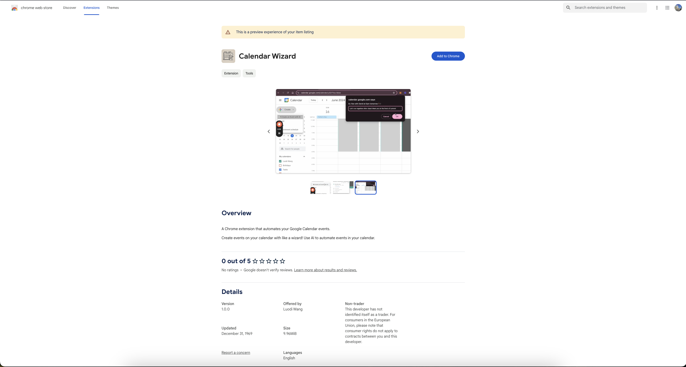
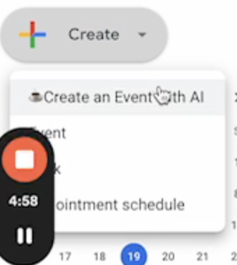
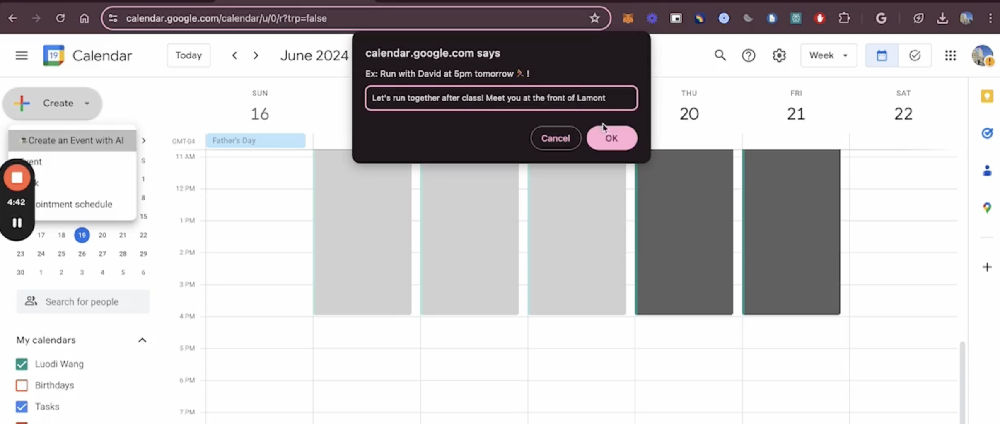
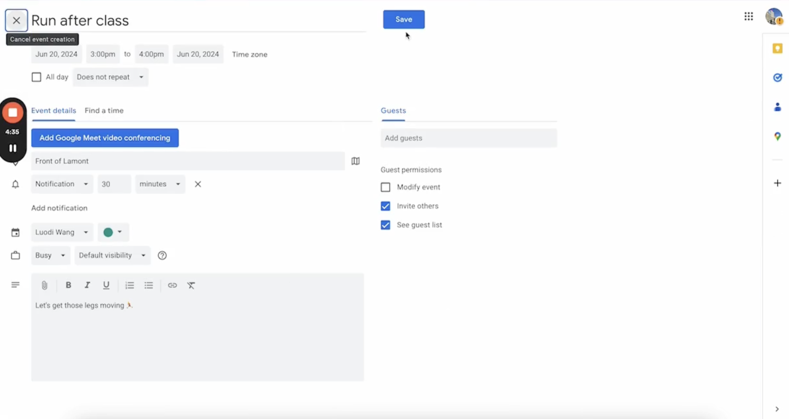

# 🧙 Calendar Wizard

Calendar Wizard is an AI Chrome extension that understands and creates events in Google Calendar for you. Tap "Create an Event with AI" under Create Event- then just write a description in the pop-up and you'll get the event ready to go. All you need is to click SAVE to get it onto your calendar.

Video Demo Here:
[calendar-wizard-demo](./calendar-wizard-demo-edited.mp4)

Preview of the Chrome extension here:


## Running the Application

1. Make a .env file and add the value to your OPENAI_API_KEY 
2. Start the server:

Install packages:

```sh
pnpm install
cd api
pnpm install
```

Start servers:

```sh
pnpm dev
cd api
pnpm dev
```

3. Go to Chrome extensions on your browser
4. Click "Load unpacked" 
5. Select folder:

```
your-path-to-magic-cal/dist
```

It may take a bit for the event to show up in your Calendar, but you should see a dropdown.


Then, write what you want to happen!


The event would appear:


Finally, after confirmation:

